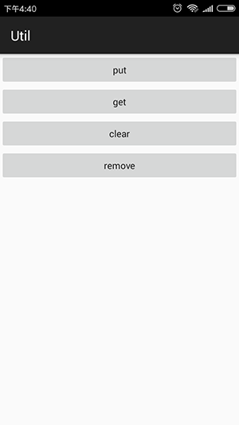

# Util_SharePreferences
 
 
   
## gradle:
```xml
dependencies {
    ...
    compile 'sing.util:library:1.0.3'
}
```  
##First
You must do it in your Application, otherwise it will crash!
```Java
public class MyApplication extends Application {

　　@Override
　　public void onCreate() {
　　　　super.onCreate();
    
　　　　SharedPreferencesUtil.init(this,"share_data");//First,share_data is the file name you save
　　}
}
```
## sample 
```JAVA 
// put (String、Integer、Boolean、Float、Long)
SharedPreferencesUtil.put("key","valse");
// get (String、Integer、Boolean、Float、Long),cast it to its original type.
SharedPreferencesUtil.get("key","default"); 
// clear
SharedPreferencesUtil.clear();
// remove
SharedPreferencesUtil.remove("key");
```
