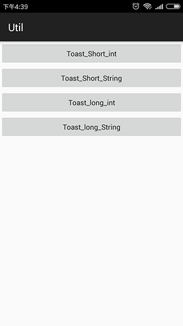
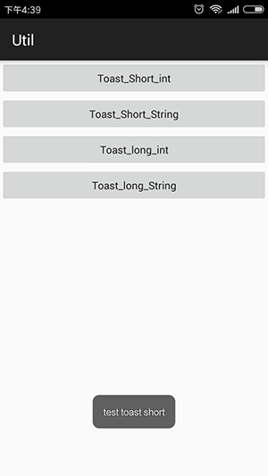

# Util_Toast
 
 
   
## gradle:
```xml
dependencies {
    ...
    compile 'sing.util:library:1.0.3'
}
```  
##You must do it in your Application, otherwise it will crash!
```Java
ToastUtil.init(this);
```
## sample 
```JAVA
public void toastShortInt(View v){
　　ToastUtil.showShort(R.string.test_toast_short);
}

public void toastShortString(View v){
　　ToastUtil.showShort("test toast short");
}

public void toastLongInt(View v){
　　ToastUtil.showLong(R.string.test_toast_long);
}

public void toastLongString(View v){
　　ToastUtil.showLong("test toast long");
}
```
