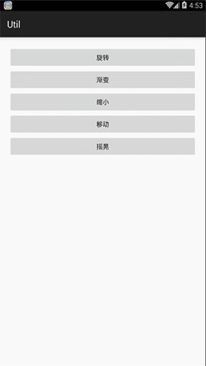

#AnimationUtil
 
 
##API
######一个旋转动画
```JAVA
// 开始角度,结束角度,旋转中心点X轴坐标相对类型,旋转中心点X轴坐标,旋转中心点Y轴坐标相对类型,旋转中心点Y轴坐标,持续时间,动画监听器
AnimationUtil.getRotateAnimation(float,float,int,float,int,float,long,AnimationListener)
```
######获取一个根据视图自身中心点旋转的动画
```JAVA
// duration,animationListener
AnimationUtil.getRotateAnimationByCenter(long,AnimationListener)
```
######获取一个透明度渐变动画
```JAVA
// 开始时的透明度，结束时的透明度都，duration
AnimationUtil.getAlphaAnimation(float,float,long,AnimationListener)
```
######获取一个由完全显示变为不可见的透明度渐变动画
```JAVA
// duration,animationListener
AnimationUtil.getHiddenAlphaAnimation(long,AnimationListener)
```
######获取一个由不可见变为完全显示的透明度渐变动画
```JAVA
// duration,animationListener
AnimationUtil.getShowAlphaAnimation(long,AnimationListener)
```
######获取一个缩小动画
```JAVA
// duration,animationListener
AnimationUtil.getLessenScaleAnimation(long,AnimationListener)
```
######获取一个放大动画
```JAVA
// duration,animationListener
AnimationUtil.getAmplificationAnimation(long,AnimationListener){
```
######将给定视图渐渐隐去
```JAVA
// 被处理的视图,在执行动画的过程中是否禁止点击,duration,animationListener
AnimationUtil.invisibleViewByAlpha(View,long,boolean,AnimationListener)
```
######将给定视图渐渐隐去最后从界面中移除
```JAVA
//被处理的视图,duration,在执行动画的过程中是否禁止点击,animationListener
AnimationUtil.goneViewByAlpha(View,long,boolean,AnimationListener)
```
######将给定视图渐渐显示出来
```JAVA
// 被处理的视图,duration,在执行动画的过程中是否禁止点击,animationListener
AnimationUtil.visibleViewByAlpha(View,long,boolean,AnimationListener)
```
######视图移动
```JAVA
// 要移动的视图,X轴开始坐标,X轴结束坐标, Y轴开始坐标, Y轴结束坐标, 重复,duration,在执行动画的过程中是否禁止点击
AnimationUtil.translate(View,float,float,float,float,float,long,boolean)
```
######视图摇晃
```JAVA
// 要摇动的视图,X轴开始坐标(0.0f),X轴结束坐标(10.0f),重复次数,duration,在执行动画的过程中是否禁止点击
AnimationUtil.shake(View,float,float,float,long,boolean)
```