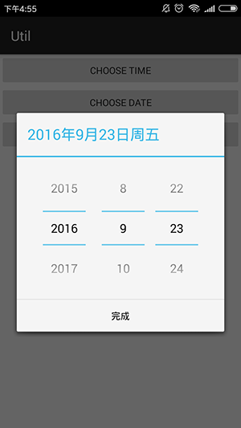
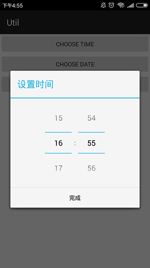

# Util_Date&Time
 
 
   
## sample 
```JAVA    
/**
 * 设置时间 
 */ 
public void chooseTime(View v){
　　DateTimeUtil.getInstance().showTime(this, new DateTimeUtil.DataCallBack() {
　　　　@Override
　　　　public void getData(String date) {
　　　　　　textView.setText(date);
　　　　}
　　},-1, -1);// 默认小时、分钟，-1为当前时间
}
 

/**
 * 设置设置日期
 * @param v
 */
public void chooseDate(View v){
　　DateTimeUtil.getInstance().showDate(this, new DateTimeUtil.DataCallBack() {
　　　　@Override
　　　　public void getData(String date) {
　　　　　　textView.setText(date);
　　　　}
　　},-1,-1,-1);// 默认年、月、日,-1为当前日期
}

/**
 * 设置日期+时间
 * @param v
 */
public void chooseTimeDate(View v){
　　DateTimeUtil.getInstance().showDialogPicker(this, new DateTimeUtil.DataCallBack() {
　　　　@Override
　　　　public void getData(String date) {
　　　　　　textView.setText(date);
　　　　}
　　},-1, -1,-1,-1,-1);// 默认小时、分钟、年、月、日
}
```
