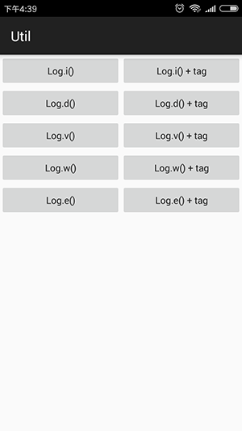
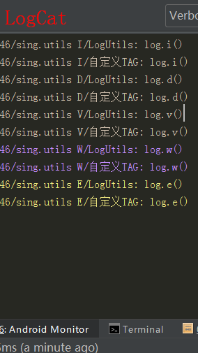

# LogUtil
 
   
## API
###### 初始化，在Application中调用，否则不会打印
```JAVA
LogUtil.init(boolean,String)//是否开启打印，默认TAG
```
###### Log.i();
```JAVA
LogUtil.i(String)//msg
LogUtil.i(String,String)//tag,msg
```
###### Log.d();
```JAVA
LogUtil.d(String)//msg
LogUtil.d(String,String)//tag,msg
```
###### Log.e();
```JAVA
LogUtil.e(String)//msg
LogUtil.e(String,String)//tag,msg
```
###### Log.v();
```JAVA
LogUtil.v(String)//msg
LogUtil.v(String,String)//tag,msg
```
###### Log.w();
```JAVA
LogUtil.w(String)//msg
LogUtil.w(String,String)//tag,msg
```
