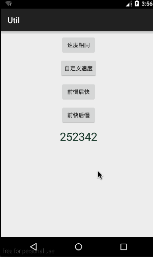

#RandomTextView



##RandomTextView的用法
xml中定义：
```xml
<sing.widget.RandomTextView
    android:id="@+id/rtv"
    android:layout_width="wrap_content"
    android:layout_height="wrap_content"
    android:layout_centerHorizontal="true"
    android:layout_centerVertical="true"
    android:text="123456"
    android:textSize="28sp"/>
```

所有位数相同速度滚动：
```JAVA
randomTextView.setText("987654");
randomTextView.setPianyilian(RandomTextView.ALL);
randomTextView.start();
```
自定义速度
```JAVA
randomTextView.setText("252342");
pianyiliang[0] = 7;
pianyiliang[1] = 6;
pianyiliang[2] = 12;
pianyiliang[3] = 8;
pianyiliang[4] = 18;
pianyiliang[5] = 10;
randomTextView.setMaxLine(20);
randomTextView.setPianyilian(pianyiliang);
randomTextView.start();
```
前慢后快
```JAVA
randomTextView.setText("234523");
randomTextView.setPianyilian(RandomTextView.FIRSTF_LAST);
randomTextView.start();
```
前快后慢
```JAVA
randomTextView.setText("534522");
randomTextView.setPianyilian(RandomTextView.FIRSTF_FIRST);
randomTextView.start();
```
防止泄漏
```JAVA
@Override
protected void onDestroy() {
    super.onDestroy();
    randomTextView.destroy();
}
```
##RandomTextView的原理
RandomTextView继承自TextView所以可以使用TextView的所有方法。
用TextView去绘制10（maxLine可设置）行文字，调用canvas.drawText去绘制出来，在绘制的Y坐标不断增加便宜量，去改变绘制的高度，通过handler.postDelayed(this, 20);不断增加偏移量，并且不断判断所有位数字最后一行绘制完毕的时候，结束handler的循环调用。