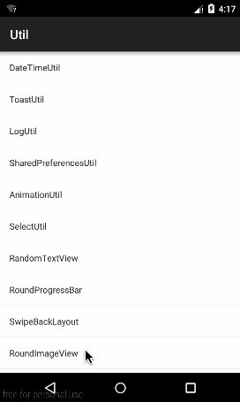

#RoundImageView
 
   
支持圆图片、圆角图片、不规则图片(4个角弧度不一样的)、支持点击效果
####感谢：
https://github.com/lzan13/MLImageViewDemo  
https://github.com/LineChen/RoundImageView
##属性介绍
>- shape_type　　　　　　　　circle(圆图片)、rect(圆角图片)、irregular(不规则图片)
>- press_alpha　　　　　　　 按下的透明度，按下效果用透明度实现
>- press_color　　　　　　　 按下颜色
>- radius　　　　　　　　　　 圆弧度(shape_type=rect时有效)
>- border_width　　　　　　　边框宽度
>- border_color　　　　　　　边框圆度
>- leftTopRadius　　　　　　 左上角弧度(shape_type=irregular时有效)
>- leftBottomRadius　　　　 左下角弧度(shape_type=irregular时有效)
>- rightTopRadius　　　　　　右上角弧度(shape_type=irregular时有效)
>- rightBottomRadius　　　　右下角弧度(shape_type=irregular时有效)
        
##效果图XML
```xml
<LinearLayout xmlns:android="http://schemas.android.com/apk/res/android"
    xmlns:melove="http://schemas.android.com/apk/res-auto"
    android:layout_width="match_parent"
    android:layout_height="match_parent"
    android:background="@android:color/white"
    android:gravity="center_horizontal"
    android:orientation="vertical">

    <sing.widget.RoundImageView
        android:layout_width="80dp"
        android:layout_height="80dp"
        android:layout_marginTop="20dp"
        android:src="@mipmap/ic_round_image"
        melove:border_color="#123123"
        melove:border_width="2dp"
        melove:press_alpha="50"
        melove:press_color="#00ff00"
        melove:radius="8dp"
        melove:shape_type="rect" />

    <sing.widget.RoundImageView
        android:layout_width="80dp"
        android:layout_height="80dp"
        android:layout_marginTop="20dp"
        android:src="@mipmap/ic_round_image"
        melove:border_color="#123123"
        melove:border_width="2dp"
        melove:shape_type="circle" />

    <FrameLayout
        android:layout_width="165dp"
        android:layout_height="165dp"
        android:layout_marginTop="20dp">

        <sing.widget.RoundImageView
            android:layout_width="80dp"
            android:layout_height="80dp"
            android:layout_gravity="top|start"
            android:src="@mipmap/ic_round_image"
            melove:border_color="#123123"
            melove:border_width="2dp"
            melove:leftBottomRadius="25dp"
            melove:leftTopRadius="0dp"
            melove:rightBottomRadius="0dp"
            melove:rightTopRadius="25dp"
            melove:shape_type="irregular" />

        <sing.widget.RoundImageView
            android:layout_width="80dp"
            android:layout_height="80dp"
            android:layout_gravity="top|end"
            android:src="@mipmap/ic_round_image"
            melove:border_color="#123123"
            melove:border_width="2dp"
            melove:leftBottomRadius="0dp"
            melove:leftTopRadius="25dp"
            melove:rightBottomRadius="25dp"
            melove:rightTopRadius="0dp"
            melove:shape_type="irregular" />

        <sing.widget.RoundImageView
            android:layout_width="80dp"
            android:layout_height="80dp"
            android:layout_gravity="bottom|start"
            android:src="@mipmap/ic_round_image"
            melove:border_color="#123123"
            melove:border_width="2dp"
            melove:leftBottomRadius="0dp"
            melove:leftTopRadius="25dp"
            melove:rightBottomRadius="25dp"
            melove:rightTopRadius="0dp"
            melove:shape_type="irregular" />

        <sing.widget.RoundImageView
            android:layout_width="80dp"
            android:layout_height="80dp"
            android:layout_gravity="bottom|end"
            android:src="@mipmap/ic_round_image"
            melove:border_color="#123123"
            melove:border_width="2dp"
            melove:leftBottomRadius="25dp"
            melove:leftTopRadius="0dp"
            melove:rightBottomRadius="0dp"
            melove:rightTopRadius="25dp"
            melove:shape_type="irregular" />
    </FrameLayout>
</LinearLayout>
```