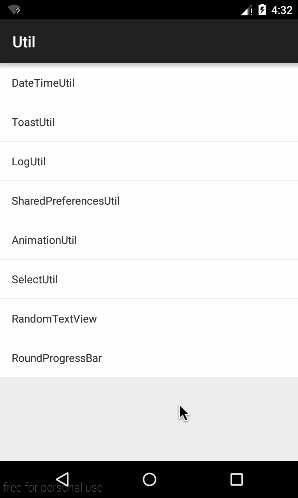

# RoundProgressBar



## RoundProgressBar的自定义属性介绍

```XML
android_custom:backgroundColor="#123123"      // 中间部分的背景颜色
android_custom:roundColor="#C6E2FF"           // 圆环的颜色
android_custom:roundProgressColor="#CD3333"   // 圆环进度的颜色
android_custom:roundWidth="10dip"             // 圆环的宽度
android_custom:textIsDisplayable="false"      // 是否显示中间的进度
android_custom:textColor="#000000"            // 中间进度百分比的字符串的颜色
android_custom:textSize="18sp"                // 中间进度百分比的字符串的字体 
android_custom:style="FILL"                   // 进度的风格，实心(FILL)或者空心(STROKE)
```
## RoundProgressBar的核心代码

```JAVA
@Override
protected void onDraw(Canvas canvas) {
    super.onDraw(canvas);
    /** 画最外层的大圆环 */
    int centre = getWidth() / 2; //获取圆心的x坐标
    int radius = (int) (centre - roundWidth / 2); //圆环的半径
    paint.setColor(roundColor); //设置圆环的颜色
    paint.setStyle(Paint.Style.STROKE); //设置空心
    paint.setStrokeWidth(roundWidth); //设置圆环的宽度
    paint.setAntiAlias(true);  //消除锯齿
    canvas.drawCircle(centre, centre, radius, paint); //画出圆环

    /** 中间部分的背景颜色 */
    paint.setColor(backgroundColor);
    paint.setStyle(Paint.Style.FILL); //设置空心
    canvas.drawCircle(centre, centre, radius - roundWidth / 2, paint); //画出圆环

    /** 画进度百分比 */
    paint.setStrokeWidth(0);
    paint.setColor(textColor);
    paint.setTextSize(textSize);
    paint.setTypeface(Typeface.DEFAULT_BOLD); //设置字体
    int percent = (int) (((float) progress / (float) max) * 100);  //中间的进度百分比，先转换成float在进行除法运算，不然都为0
    float textWidth = paint.measureText(percent + "%");   //测量字体宽度，我们需要根据字体的宽度设置在圆环中间

    if (textIsDisplayable && percent != 0 && style == STROKE) {
        canvas.drawText(percent + "%", centre - textWidth / 2, centre + textSize / 2, paint); //画出进度百分比
    }

    /** 画圆弧 ，画圆环的进度 */
    //设置进度是实心还是空心
    paint.setStrokeWidth(roundWidth); //设置圆环的宽度
    paint.setColor(roundProgressColor);  //设置进度的颜色
    RectF oval = new RectF(centre - radius, centre - radius, centre + radius, centre + radius);  //用于定义的圆弧的形状和大小的界限

    switch (style) {
        case STROKE: {
            paint.setStyle(Paint.Style.STROKE);
            canvas.drawArc(oval, 0, 360 * progress / max, false, paint);  //根据进度画圆弧
            break;
        }
        case FILL: {
            paint.setStyle(Paint.Style.FILL_AND_STROKE);
            if (progress != 0)
                canvas.drawArc(oval, 0, 360 * progress / max, true, paint);  //根据进度画圆弧
            break;
        }
    }
}
```
## DEMO
效果图的样式
 
```XML
 <sing.widget.RoundProgressBar
    android:id="@+id/roundProgressBar01"
    android:layout_width="80dp"
    android:layout_height="80dp"
    android_custom:backgroundColor="#123123" />
    
 <sing.widget.RoundProgressBar
    android:id="@+id/roundProgressBar02"
    android:layout_width="80dp"
    android:layout_height="80dp"
    android_custom:backgroundColor="#C2C2C2"
    android_custom:roundColor="#C6E2FF"
    android_custom:roundProgressColor="#CD3333"
    android_custom:roundWidth="10dip"
    android_custom:textIsDisplayable="false" />
        
<sing.widget.RoundProgressBar
    android:id="@+id/roundProgressBar03"
    android:layout_width="80dp"
    android:layout_height="80dp"
    android_custom:backgroundColor="#FFFFFF"
    android_custom:roundColor="#D1D1D1"
    android_custom:roundProgressColor="@android:color/black"
    android_custom:roundWidth="10dp"
    android_custom:textColor="#000000"
    android_custom:textSize="18sp" />

<sing.widget.RoundProgressBar
    android:id="@+id/roundProgressBar04"
    android:layout_width="80dp"
    android:layout_height="80dp"
    android_custom:roundProgressColor="#C2C2C2"
    android_custom:roundWidth="1dp"
    android_custom:style="FILL" />
```

```JAVA
private int mTotalProgress = 100;
private int mCurrentProgress = 0;
private RoundProgressBar rpBar01, rpBar02 ,rpBar03, rpBar04;// 找控件部分略
 
new Thread(new ProgressRunable()).start();// 适当的时间启动

class ProgressRunable implements Runnable {

    @Override
    public void run() {
        while (mCurrentProgress < mTotalProgress) {
            mCurrentProgress += 1;

            rpBar01.setProgress(mCurrentProgress);
            rpBar02.setProgress(mCurrentProgress);
            rpBar03.setProgress(mCurrentProgress);
            rpBar04.setProgress(mCurrentProgress);

            try {
                Thread.sleep(100);
            }
            catch (Exception e) {
                e.printStackTrace();
            }
        }
    }
}
```