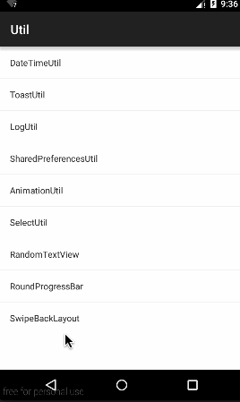

#SwipeBackLayout
 
  
本片属于轻量级的右滑关闭，单单是右滑，如果需要扩展请移步https://github.com/ikew0ng/SwipeBackLayout
##用法
1、主题一定要透明化
```JAVA
<item name="android:windowBackground">@android:color/transparent</item>
<item name="android:windowIsTranslucent">true</item>
<item name="android:windowAnimationStyle">@android:style/Animation</item>
```
2、在Activity的onCreate()中加入代码:new SwipeBackLayout(this),考虑到布局可能存在横向滑动的控件，故默认为屏幕宽度的1/10为有效滑动区域，同时提供了自定义有效滑动区域，若想全屏滑动，传入屏幕宽度即可。
```JAVA
@Override
protected void onCreate(@Nullable Bundle savedInstanceState) {
   super.onCreate(savedInstanceState);
   
   new SwipeBackLayout(this);
   // new SwipeBackLayout(this, 100);
   ...
}
```
没错就是这么简单，建议将这个代码封装在BaseActivity中。